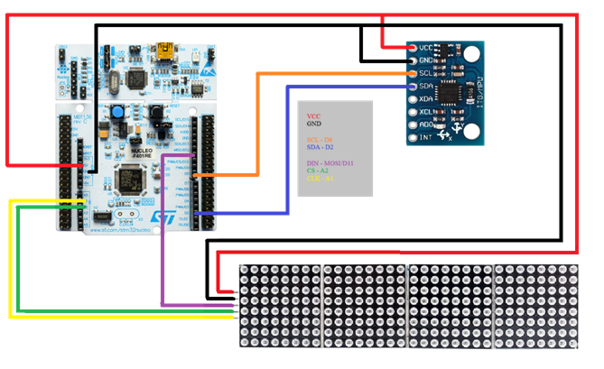

# Embedded Liquid Simulation with Kalman filter

**Real-time particle-based liquid simulation running on an STM32 microcontroller, controlled via MPU6050 IMU and displayed on a MAX7219 LED matrix.**


## Overview

This project implements a **real-time fluid simulation engine** on embedded hardware. The liquid reacts to board tilt using the **MPU6050 IMU** with a **Kalman filter** for pitch and roll estimation. The simulation is rendered on a **MAX7219 LED matrix**.

All peripheral drivers (I2C and SPI) are implemented in **bare-metal C**, and the simulation engine models particle collisions, boundary interactions, and surface tension in real time.

No library used. 
### Circuit


## Features

- **Bare-metal peripheral drivers**:
  - SPI for MAX7219 LED matrix
  - I2C for MPU6050 IMU
- **Sensor fusion**: Kalman filter for orientation estimation
- **Particle-based fluid simulation engine**:
  - Real-time velocity and position updates
  - Particle-particle collision handling
  - Surface tension modeling
- **Boundary handling** for particles
- Optimized for **microcontroller real-time execution**
- Fully structured **embedded C project** ready for STM32CubeIDE

## Hardware

- **Microcontroller**: STM32G071R
- **Display**: 4 daisy chained MAX7219 8x8 LED matrix  
- **Sensor**: MPU6050 IMU  
- **Peripherals:** SPI and I2C communication  

## Software Structure

- **Core/** – MCU startup code and main application
- **BSP/** – SPI/I2C/IM2 
- **Devices/** - MAX7219 & MPU6050 drivers
- **Filters/** – Kalman filter implementation
- **Simulations/** – Particle-based fluid simulation engine
- **Utilities/** – Helper functions (timeout)

## Notes / System Configuration

**FLEXIBILITY**
- The system is designed to be **highly flexible** in terms of LED matrix size.  
- Currently, the project uses **4 daisy-chained MAX7219 modules**, but you can easily change the number of modules.  
- To adjust, simply modify the `DAISY_CHAIN_NUMBER` macro in: /BSP/SPI/SPI.h
- This single change automatically updates:
  - The **SPI buffer size** (used for communication)
  - The **rendering matrix width** (X size) for the liquid simulation
- No other changes are required in the code — the simulation and rendering logic adapt automatically.
- For example, to use only 1 MAX7219 module:
```c
#define DAISY_CHAIN_NUMBER 1
```
- This allows easy scaling of the LED matrix without modifying the simulation logic, making the system modular and adaptable to different hardware setups.

**MPU6050 ORIENTATION**
- Due to the breadboard setup in this project, the IMU’s orientation differs from the standard MPU6050 axis configuration.  
- The Kalman filter and gravity update functions account for this custom orientation, so the simulation responds correctly to tilt.

## Future Development

**Eulerian grid-based fluid simulation**  
- Replace the current particle-based simulation with a grid-based approach for more accurate fluid dynamics and smoother visualization.  
- This could improve interactions like waves, splashes, and more realistic surface tension.

**Custom PCB design**  
- Design a dedicated PCB to integrate the STM32, MAX7219 modules, and MPU6050.  
- This will make the system more compact, robust, and suitable for demonstrations or a product prototype.

## Useful links

- Reference manual for STM32G0x1: https://www.st.com/resource/en/reference_manual/rm0444-stm32g0x1-advanced-armbased-32bit-mcus-stmicroelectronics.pdf
- User manual for STM32 Nucleo-64 boards: https://www.st.com/resource/en/user_manual/um2324-stm32-nucleo64-boards-mb1360-stmicroelectronics.pdf
- STM32G071 datasheet: https://www.st.com/resource/en/datasheet/stm32g071c8.pdf
- Nucleo-G071RB overview: https://os.mbed.com/platforms/ST-Nucleo-G071RB/
